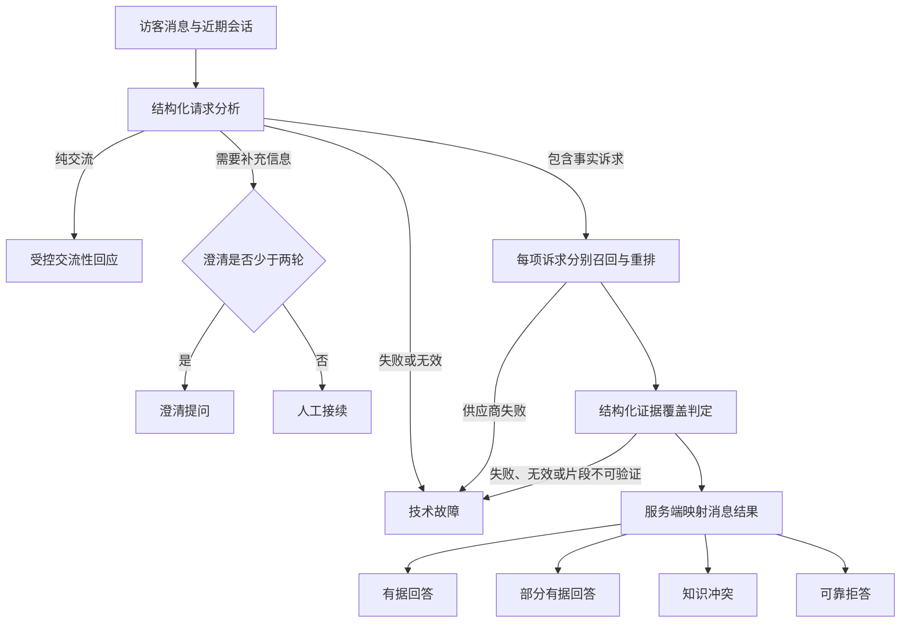

# 结构化请求分析与证据覆盖规格

Status: accepted

## 背景

GroundedDesk 当前用两类机制决定访客消息如何结束：

- `conversational-response.ts` 通过固定表达集合和正则识别问候、致谢、告别、身份、能力与范围外请求；
- `clarification-request.ts` 通过中英文主题白名单识别残缺问题；
- 其余消息按整条文本进行一次召回和重排，只要没有内容单元达到统一重排阈值，就形成可靠拒答。

这套机制在固定样例上可预测，但具有四个结构性问题：

1. 自然语言改写需要不断扩充表达集合、正则和主题白名单，规则之间难以证明完整或互斥。
2. 重排相关性与证据充分性被压成同一个阈值，相关但表述不同的知识可能被过早排除。
3. 一条消息包含多项事实诉求时，整句检索可能漏掉其中一部分，系统也无法表达部分有据回答。
4. 无证据、知识冲突、信息不完整与分析故障容易被收敛为可靠拒答，污染待解决问题和运营指标。

本设计改变回答结果的决策机制，但不放松“业务事实必须由内容单元支持”的不变量。

## 目标

- 用稳定的结构化语义契约取代持续增长的关键词、正则和主题白名单。
- 将一条消息拆分为最多三项事实诉求，并逐项检索、判断证据覆盖和关联引用。
- 只有完整事实诉求全部没有证据覆盖时才形成可靠拒答。
- 支持部分有据回答、知识冲突、两轮澄清和人工接续。
- 让管理员能够复现每项回答、拒答和冲突判断。
- 保持技术故障、预算阻断与知识不足的语义隔离。
- 通过版本化决策评测集发布和回归新的决策策略。

## 不变量

- 任何业务事实只能来自服务端选定且通过覆盖判定的内容单元片段。
- 访客消息、近期会话内容、知识来源内容和模型输出都属于不可信输入。
- 模型输出只提供候选决策，服务端结构校验和状态映射拥有最终权威。
- 引用只能由服务端依据证据关系创建，模型不得生成可信链接。
- 交流性回应继续使用受控模板，不能自由扩展业务事实或承诺。
- 技术故障和预算阻断不得伪装成可靠拒答，也不得创建待解决问题。
- 管理员不能编辑请求分析提示词、覆盖判定规则或发布阈值。

## 领域结果

| 结果 | 含义 | 引用 | 待解决问题 | 质量反馈 |
| --- | --- | --- | --- | --- |
| 交流性回应 | 纯非事实交流或明确范围外请求 | 无 | 无 | 无 |
| 澄清提问 | 事实诉求仍缺少必要信息，且未达到两轮上限 | 无 | 无 | 无 |
| 人工接续 | 两轮澄清后仍无法继续，提供人工联系入口 | 无 | 无 | 无 |
| 有据回答 | 所有事实诉求都获得证据覆盖 | 逐项关联 | 仅负面反馈时创建 | 支持 |
| 部分有据回答 | 至少一项受到支持，另有无支持、冲突或无法继续澄清的诉求 | 逐项关联 | 为无支持与冲突项分别创建 | 仅评价已回答部分 |
| 知识冲突 | 没有可直接回答的诉求，且至少一项存在互相矛盾的依据 | 展示冲突双方 | 为冲突项分别创建 | 无 |
| 可靠拒答 | 完整事实诉求全部没有证据覆盖 | 无 | 为各事实诉求分别创建 | 支持 |
| 技术故障 | 系统暂时无法完成处理 | 无 | 无 | 无 |

技术故障沿用失败消息与可重试响应路径，不需要伪装成已完成的业务回答。

## 处理流程



只要消息同时包含交流表达和事实诉求，就进入事实诉求路径；交流意图可以影响礼貌表达，但不能绕过检索。

## 一、结构化请求分析

### 职责

请求分析器负责：

- 识别纯交流、事实、交流与事实混合、信息不完整四类交互；
- 识别问候、致谢、告别、身份、能力和范围外等交流意图；
- 从消息与必要的近期上下文中提取最多三项事实诉求；
- 判断每项事实诉求是否完整，并描述仍缺少的必要信息；
- 检测明显语言，以便选择受控模板和回答语言。

请求分析器不负责：

- 判断知识是否足够；
- 选择内容单元；
- 授权模型使用常识回答；
- 决定是否计费、是否创建引用或待解决问题；
- 输出面向访客的自由文本答案。

### 建议契约

```ts
type RequestAnalysis = {
  version: string;
  language: "zh" | "en";
  interactionType:
    | "conversational"
    | "factual"
    | "mixed"
    | "incomplete";
  conversationalIntent:
    | "greeting"
    | "gratitude"
    | "farewell"
    | "identity"
    | "capability"
    | "out_of_scope"
    | null;
  factualRequests: Array<{
    id: string;
    originalText: string;
    normalizedQuestion: string;
    completeness: "complete" | "incomplete";
    missingInformation: string[];
  }>;
};
```

`factualRequests` 最多包含三项。超过三项时形成一次请求缩小范围的澄清提问；该提问计入两轮澄清上限。

### 校验与失败

- 使用严格 JSON Schema 校验枚举、数组数量、字符串长度和必填字段。
- 分析结果不能携带模型选择、预算豁免、可信引用或最终结果类型。
- 无效结构重试一次；第二次仍无效、超时或供应商失败时形成技术故障。
- 不回退到关键词表，也不把整条消息保守地转换为可靠拒答。
- 请求分析调用计入 AI 预算和 AI 调用日志，并受公开消息频率与并发限制。

## 二、逐项召回与重排

- 每项完整事实诉求分别生成检索输入并执行召回与重排。
- 澄清后的检索输入可以包含与当前事实诉求相关的近期访客消息和澄清提问，但先前助手回答不成为事实证据。
- 候选内容单元按组织、助手知识范围、启用状态和当前知识版本过滤。
- 每项事实诉求设置候选数量上限；跨诉求重复的内容单元可以在后续调用中去重。
- 重排分数用于候选排序和低质量噪声下限，不直接代表证据充分性。
- 不再使用“没有候选超过统一重排阈值”直接触发可靠拒答。
- 候选上限和噪声下限由系统统一配置，通过评测校准，不向管理员开放。

## 三、证据覆盖判定

### 职责

证据覆盖判定器接收事实诉求及其候选内容单元，逐项输出：

- `supported`：一个或多个内容单元足以支持明确回答；
- `unsupported`：候选内容单元没有提供足以回答该诉求的事实；
- `conflicting`：不同内容单元在相同适用范围内提供无法同时成立的事实。

判定器不能把相关主题、常识、先前助手回答或模型自身知识当作支持。

### 建议契约

```ts
type EvidenceCoverageDecision = {
  version: string;
  decisions: Array<{
    factualRequestId: string;
    status: "supported" | "unsupported" | "conflicting";
    evidence: Array<{
      contentUnitId: string;
      relationship: "supports" | "conflicts";
      exactExcerpt: string;
      reason: string;
    }>;
  }>;
};
```

### 可验证性

- `supported` 必须至少包含一个 `supports` 证据关系。
- `conflicting` 必须包含至少两个能够说明冲突的证据关系。
- `unsupported` 的证据数组必须为空。
- 服务端验证内容单元属于本次候选集合和当前组织。
- `exactExcerpt` 必须是对应内容单元原文的规范化后连续片段，并受长度限制。
- 理由只用于管理员审计，不作为事实依据，也不直接展示给访客。
- 任一关系验证失败时，整次判定无效；重试一次后仍无效则形成技术故障。

## 四、结果映射

服务端根据逐项状态确定消息级结果，模型不得直接选择最终结果：

1. 没有事实诉求且属于交流意图：交流性回应。
2. 没有受到支持的诉求，存在未完成诉求且澄清少于两轮：澄清提问。
3. 没有受到支持的诉求，未完成诉求已经澄清两轮：人工接续。
4. 所有完整事实诉求均为 `supported`：有据回答。
5. 至少一项为 `supported`，同时存在 `unsupported`、`conflicting`、未完成或需要人工接续的诉求：部分有据回答。
6. 没有 `supported`，但至少一项为 `conflicting`：知识冲突。
7. 所有事实诉求都完整且均为 `unsupported`：可靠拒答。
8. 任一必要处理阶段失败：技术故障。

当多个非支持状态同时出现时，消息级结果不丢失逐项状态；管理员复盘和待解决问题始终以事实诉求为单位。

## 五、回答组合与引用

- 回答生成模型只接收 `supported` 事实诉求及其已经验证的证据片段。
- 回答生成输出按 `factualRequestId` 分段，服务端保持访客原始诉求顺序。
- `unsupported`、`conflicting`、澄清和人工接续部分使用服务端受控表达，不交给回答模型自由生成。
- 部分有据回答将受支持正文和未覆盖、冲突或人工接续说明组合成一条可读消息。
- 引用由服务端根据证据关系创建并关联到具体事实诉求。
- 支持性段落只展示 `supports` 引用；知识冲突段落同时展示形成冲突的来源。
- 模型输出的 URL、来源名称或引用标记都不成为可信引用。
- 质量反馈文案对部分有据回答明确为“以上已回答部分有帮助吗？”。

## 六、澄清与人工接续

- 信息不完整时，分析器必须给出具体缺失信息，服务端据此生成有针对性的澄清提问。
- 同一连续事实诉求最多澄清两轮。
- 第二轮不得原样重复第一轮问题；只有识别出仍缺少的信息时才能继续澄清。
- 两轮后仍不完整时形成人工接续，展示助手配置的人工联系入口。
- 澄清提问和人工接续都不创建待解决问题，也不计入可靠拒答。
- 一项受支持事实诉求与另一项未完成诉求并存时，消息形成部分有据回答，同时对未完成项提问或提供人工接续。
- 一个已完成且不含待澄清事实诉求的新意图会结束上一意图的澄清计数。

## 七、交流性回应

- 请求分析器取代固定表达集合和正则，负责交流意图的语义分类。
- 交流性回应继续使用由助手名称、服务范围、语气和语言组成的受控模板。
- 纯交流消息不执行知识召回、重排、证据覆盖或回答生成。
- 请求分析调用仍计入 AI 预算，因此交流性回应不再保证在每日 AI 预算耗尽后可用。
- 预算耗尽返回现有额度阻断结果，不形成可靠拒答或技术故障。
- 交流消息继续计入会话消息上限，并受同一频率和并发限制。

## 八、持久化模型

实现需要支持一条助手消息关联多项事实诉求和多组证据关系。建议引入以下逻辑实体；最终表名可按现有数据库命名约定确定。

### 消息事实诉求

每项记录至少保存：

- 组织、会话、访客消息和助手消息身份；
- 原始顺序、原始文本和规范化问题；
- 完整性与最终覆盖状态；
- 缺失信息与澄清轮次；
- 请求分析器版本。

### 证据快照

每项记录至少保存：

- 事实诉求身份；
- 判定时的内容单元与知识来源身份；
- `supports` 或 `conflicts` 关系；
- 受长度限制的原文片段；
- 覆盖判定理由和判定器版本。

证据快照与会话采用相同的组织隔离和保留期限，删除会话时一并删除；知识来源更新或删除不改写当时快照。证据快照不写入通用 AI 调用日志。

### 消息与引用

- 扩展消息结果类型以包含 `partially_grounded_answer`、`knowledge_conflict` 和 `human_handoff`。
- 引用增加事实诉求关联，使同一消息中的各段内容拥有独立引用集合。
- 历史引用可以保持消息级关联，不进行推断回填。

### 待解决问题

- 移除“一条助手消息最多一个待解决问题”的现有限制。
- 待解决问题可以关联具体事实诉求。
- 部分有据回答为每个 `unsupported` 与 `conflicting` 事实诉求分别创建待解决问题。
- 纯知识冲突为每个冲突事实诉求分别创建待解决问题。
- 可靠拒答为每个完整但无支持的事实诉求分别创建待解决问题。
- 部分有据回答收到负面质量反馈时，额外记录回答质量问题，不覆盖或合并已经创建的知识缺口。
- 约束必须避免同一助手消息、事实诉求和触发类型重复建项，同时允许消息级负面质量反馈与诉求级知识缺口并存。

### AI 调用日志

- 调用类型增加请求分析和证据覆盖。
- 继续只保存供应商、模型、Token、耗时、结果、安全错误和追踪信息。
- 不在通用日志中保存访客原文、原始提示词、模型隐藏推理、完整内容单元或证据快照。

## 九、管理员审计

会话复盘应按访客原始顺序展示：

- 请求分析出的事实诉求及完整性；
- 每项诉求的支持、无支持或冲突状态；
- 实际采用的内容单元、原文片段和简短判定理由；
- 逐项引用；
- 消息级结果的映射原因；
- 请求分析器、覆盖判定器和策略版本；
- 各阶段调用结果与技术追踪信息。

不得展示模型隐藏推理或系统提示词。管理员可以依据审计信息更新知识来源或处理待解决问题，但不能直接编辑判定结果或策略。

## 十、API 与流式响应

现有只包含正文增量和消息级引用的流式契约不足以表达逐项状态。新的响应契约需要：

- 为每个响应段携带稳定的事实诉求 ID、顺序和状态；
- 让正文增量明确属于某个受支持段；
- 在段完成时返回该段的服务端引用；
- 为无支持、冲突、澄清和人工接续段返回受控展示数据；
- 在消息完成事件中返回唯一消息级结果和所有段的最终快照；
- 保留技术故障与预算阻断的现有错误通道。

访客端和管理员预览端必须共享同一服务端决策与流式契约。

## 十一、失败与重试

| 阶段 | 失败处理 |
| --- | --- |
| 请求分析 | 重试一次，仍失败则技术故障 |
| Embedding、召回或重排 | 沿用供应商重试策略，仍失败则技术故障 |
| 证据覆盖 | 结构或片段校验失败时重试一次，仍失败则技术故障 |
| 回答生成 | 沿用安全重试边界，仍失败则技术故障 |
| 持久化 | 不形成部分完成消息；返回可诊断技术故障 |
| AI 预算不足 | 返回额度阻断，不调用分析器，不形成技术故障或可靠拒答 |

任何技术故障都不得保存为有据回答、部分有据回答、知识冲突或可靠拒答，也不得创建待解决问题。

## 十二、评测与发布门槛

### 数据集

在现有 20 题检索基线之外新增独立、版本化的决策评测集，至少覆盖：

- 单项事实诉求：支持、无支持和语义改写；
- 复合问题：全部支持、部分支持、全部无支持和超过三项；
- 知识冲突与看似冲突但适用范围不同的内容；
- 零、一、两轮澄清及人工接续；
- 纯交流、交流与业务问题混合、范围外请求；
- 中文、英文和中英混合输入；
- 提示词注入、恶意知识内容和伪造引用；
- 分析器与覆盖判定器无效结构、超时和供应商故障。

每个样例标注：

- 预期交流意图；
- 预期事实诉求及完整性；
- 每项诉求的预期证据覆盖状态和允许的内容单元；
- 预期消息级结果；
- 预期引用、待解决问题和语言。

### 指标

至少报告：

- 事实诉求漏拆、错拆和不必要拆分；
- 错误回答和错误拒答；
- 部分有据回答识别错误；
- 知识冲突漏检和误报；
- 不必要澄清与错误人工接续；
- 来源外事实、无效证据片段和错误引用；
- 各结果按语言和单项/复合问题分组后的混淆矩阵；
- 请求分析、逐项检索、覆盖判定和回答生成的调用量与延迟。

### 发布门槛

- 来源外事实、不可验证证据片段、错误引用和技术故障伪装成可靠拒答在契约评测中必须为零。
- 新策略的错误回答不得高于现有基线。
- 新策略必须实质降低错误拒答，并通过部分支持、知识冲突和澄清的全部契约样例。
- 任何模型、提示契约、候选配置或状态映射变化都必须生成新策略版本并重新运行完整评测。
- 当前 20 题检索基线继续作为召回与引用回归测试，但不再单独证明回答决策可发布。

## 十三、迁移与上线

1. 先增加新结果类型、事实诉求、证据快照、逐项引用和多待解决问题的数据契约。
2. 在功能开关后实现请求分析、逐项检索和覆盖判定，不改变现有公开行为。
3. 使用固定评测集和管理员预览比较旧策略与新策略，检查错误拒答、来源外事实、冲突和成本。
4. 达到发布门槛后，同时切换公开助手和管理员预览，避免两套决策行为。
5. 保留策略版本，以便诊断和回滚行为；不通过恢复关键词表进行回滚。
6. 历史消息、引用、质量反馈和待解决问题不重新分析、不回填事实诉求，也不重写原结果。

## 十四、安全与隐私

- 结构化 Schema 只接受已知字段、枚举和有界数组；忽略或拒绝额外字段。
- 服务端验证每个内容单元的组织归属、知识版本和候选身份。
- 原文片段必须可在内容单元中复核，不能接受模型改写后的“近似引文”。
- 回答模型只接收受支持诉求及其最小证据片段，减少无关不可信内容暴露。
- 证据快照受组织边界、RLS、会话保留和删除策略约束。
- 模型输出不能影响频率限制、预算、数据权限、引用 URL 或策略版本。
- 提示词注入样例同时进入请求分析、覆盖判定和回答生成评测。

## 十五、替代方案

### 继续扩充关键词、正则和主题白名单

拒绝。它在固定样例上成本低，但无法覆盖自然改写和复合意图，维护成本随业务语言持续增长。

### 仅降低统一重排阈值

拒绝。它会同时提高召回率和无关证据准入率，仍不能表达部分支持或知识冲突。

### 让回答模型自行决定是否拒答

拒绝。自由文本结果难以校验、审计和稳定映射，也容易把提示词注入或模型常识误当成业务证据。

### 为每个管理员开放提示词和阈值

拒绝。不同助手将产生不可比较、不可复现的可靠性策略，并破坏统一发布门槛。

### 对每项回答做逐项访客反馈

首版不采用。部分有据回答只对已回答部分收集一次整体反馈；未覆盖和冲突诉求已经分别进入待解决问题。

## 十六、被本设计取代的旧实现决定

`.scratch/conversational-response-and-clarification/spec.md` 中以下决定被本规格取代：

- “不得使用大模型作为每条消息的前置意图分类器”；
- “交流性回应不消耗 AI 预算，并在每日预算耗尽后仍可使用”；
- “同一意图最多连续出现一次澄清，下一次无证据时可靠拒答”；
- 通过固定中英文表达集合、范围外正则和残缺主题白名单实现高置信路由的方式。

ADR-0005“区分非事实交流与有据回答”的领域边界继续有效；本设计改变的是如何识别和证明各类结果。

## 十七、非目标

- 不允许模型依据常识补全业务事实。
- 不允许自由生成笑话、代码、天气或其他范围外内容。
- 不支持一条消息自动处理超过三项事实诉求。
- 首版不训练项目专用分类模型。
- 不向管理员开放决策提示词、判定器模型或阈值。
- 不回填或重新分类历史会话。
- 不改变知识来源原子更新、组织隔离或引用来源身份快照原则。
